# @genart-dev/plugin-plants

Algorithmic plant generation plugin for [genart.dev](https://genart.dev) — 110 botanically-accurate presets across 9 categories, powered by L-system, phyllotaxis, and geometric engines. 9 drawing styles, 5 detail levels, 3D turtle projection, growth animation, wind dynamics, ecosystem composition, and 19 MCP tools for AI-agent control.

Part of [genart.dev](https://genart.dev) — a generative art platform with an MCP server, desktop app, and IDE extensions.

## Gallery

**9 drawing styles** — every plant renders in any style:

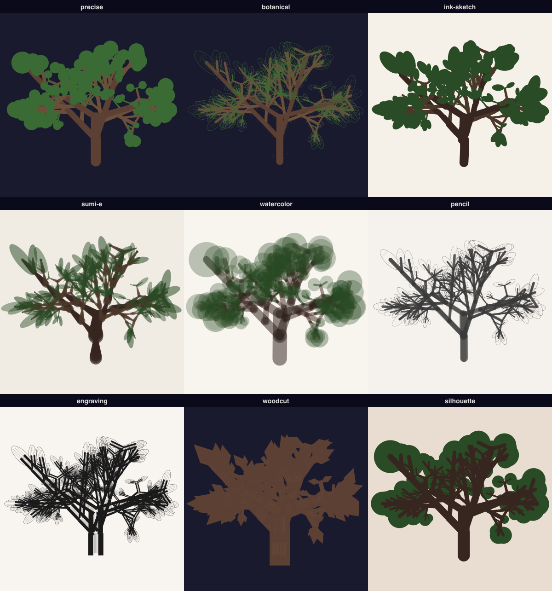

**Growth animation** — continuous seed-to-bloom with tDOL time parameter:

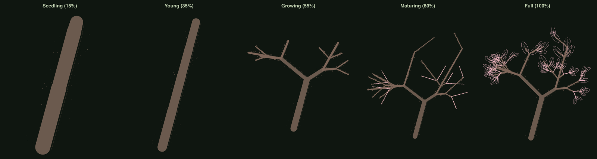

**Hero renders:**

| Cherry Blossom × Watercolor | Bonsai × Sumi-e | Birch × Ink Sketch |
|:---:|:---:|:---:|
| 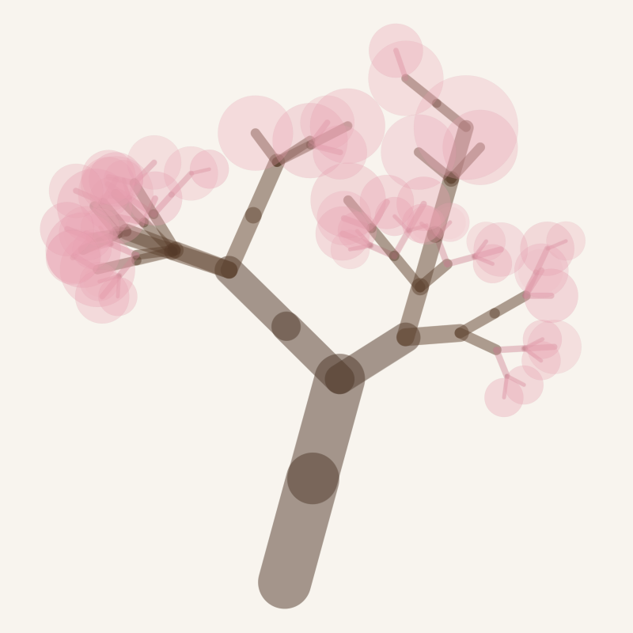 | 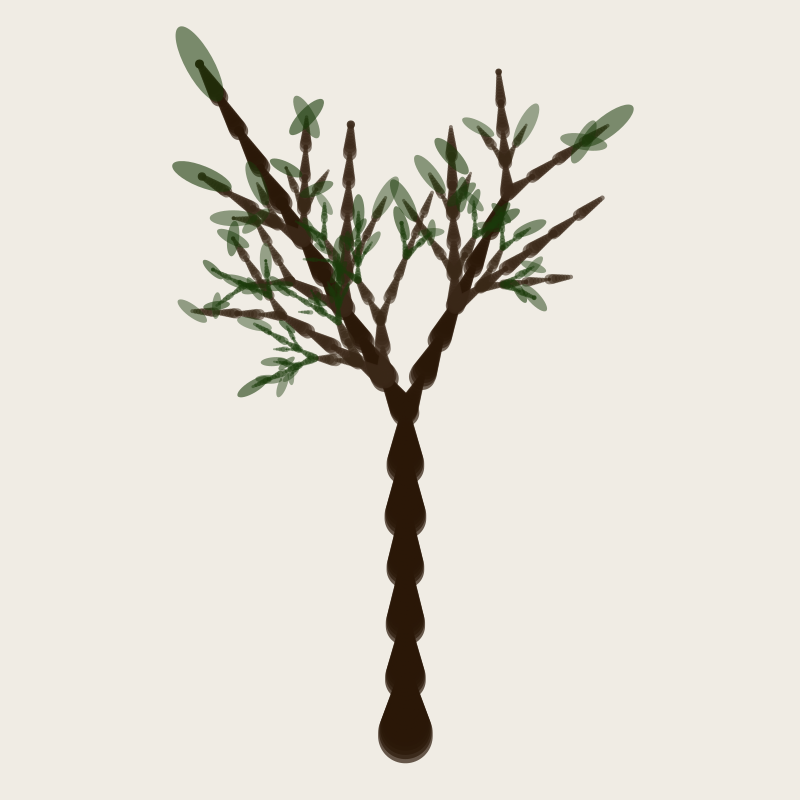 | 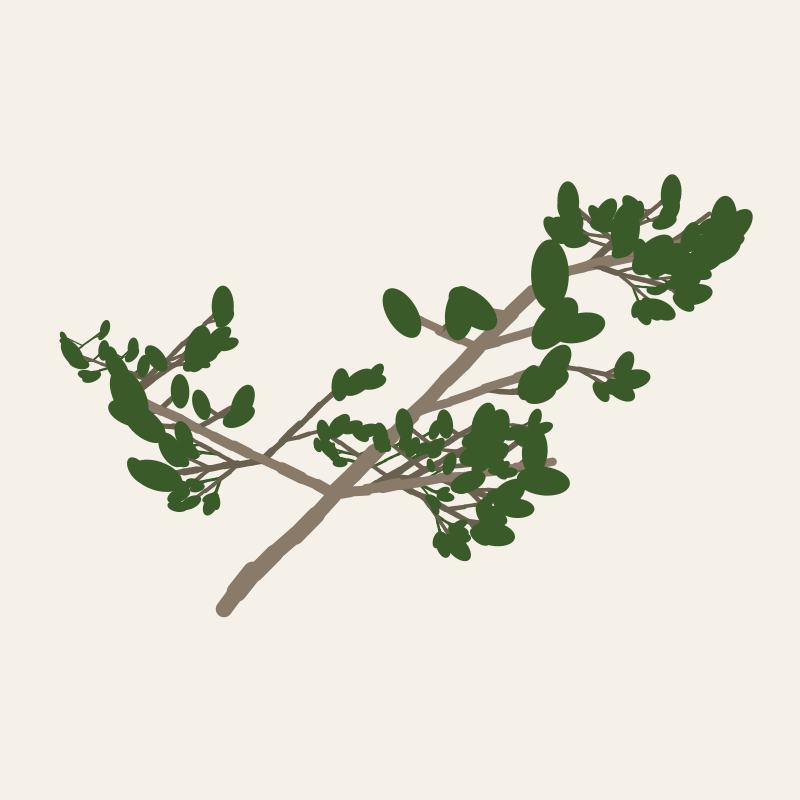 |

| Maple × Pencil | Willow × Silhouette | Cherry × Fruit |
|:---:|:---:|:---:|
| 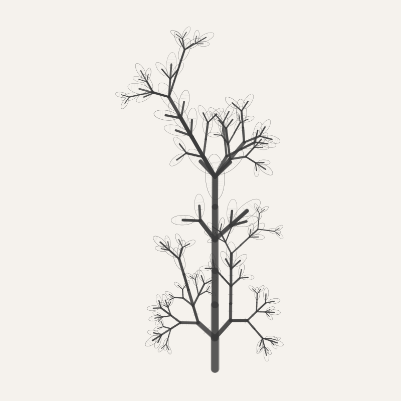 | 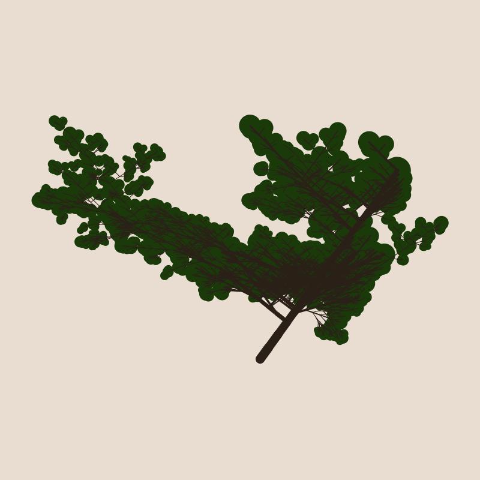 | 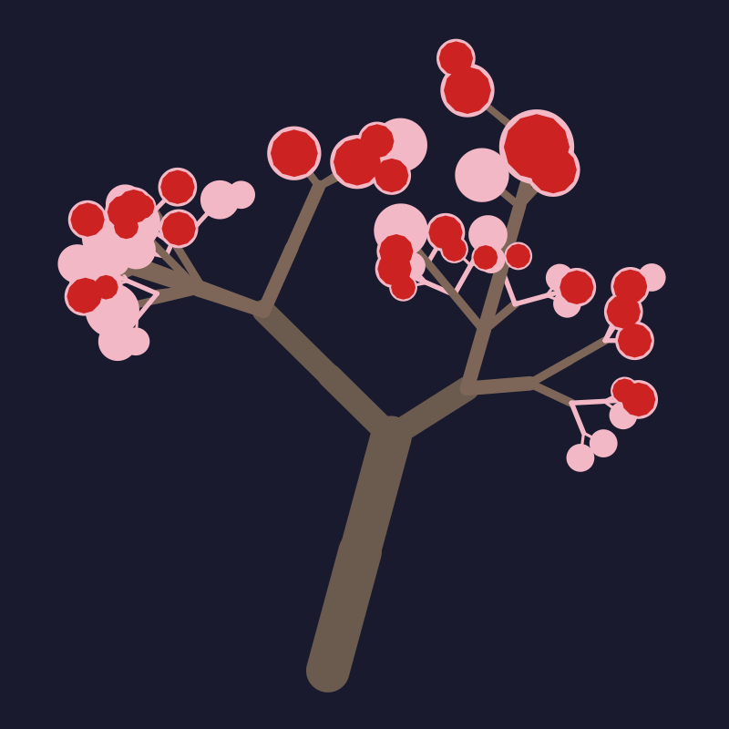 |

**Ecosystems** — multi-species compositions with depth and atmosphere:

| Japanese Garden (Sumi-e) | Dark Forest (Woodcut) | Riverside (Watercolor) |
|:---:|:---:|:---:|
| 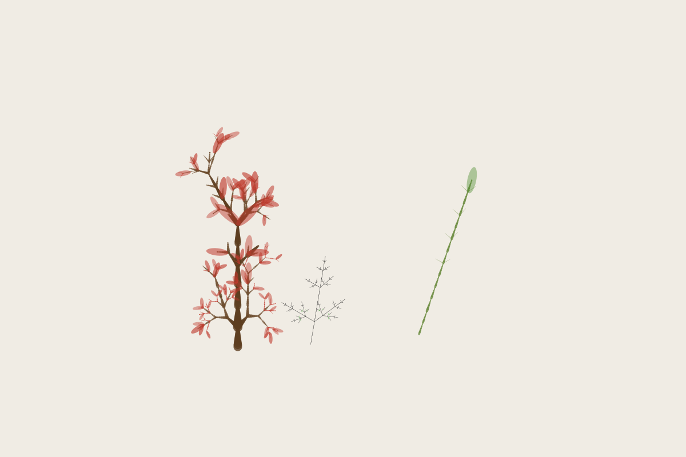 | 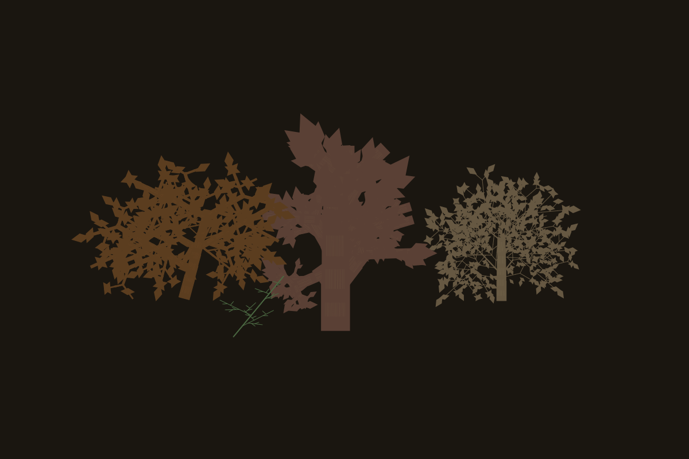 | 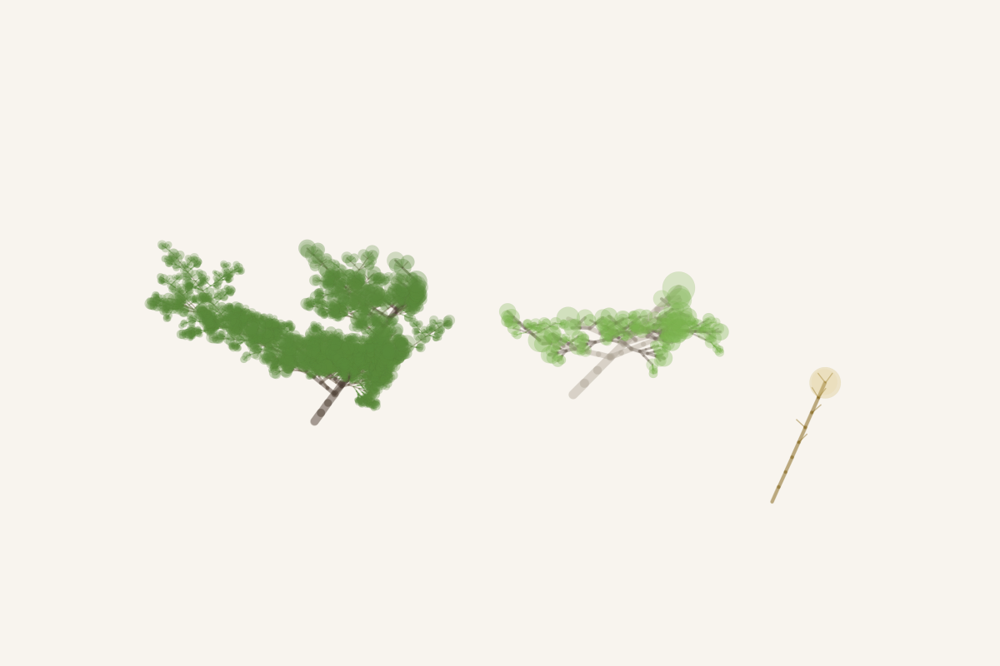 |

## Install

```bash
npm install @genart-dev/plugin-plants
```

## Usage

```typescript
import plantsPlugin from "@genart-dev/plugin-plants";
import { createDefaultRegistry } from "@genart-dev/core";

const registry = createDefaultRegistry();
registry.registerPlugin(plantsPlugin);

// Or access individual exports
import {
  ALL_PRESETS,
  getPreset,
  filterPresets,
  searchPresets,
  iterateLSystem,
  turtleInterpret,
  generatePhyllotaxis,
} from "@genart-dev/plugin-plants";
```

## Engines

Three generation engines cover the full range of plant morphology:

### L-system (~80 presets)

Parametric Lindenmayer systems with stochastic and context-sensitive productions. A turtle interpreter converts module strings into branching geometry with continuous segment tapering (da Vinci width decay at branches + per-segment taper along trunk/branch runs), tropism forces, angle jitter, and implicit leaf placement at terminal branches.

```typescript
import { iterateLSystem, turtleInterpret, modulesToString } from "@genart-dev/plugin-plants";

const preset = getPreset("english-oak");
const modules = iterateLSystem(preset.definition, 42);
const output = turtleInterpret(modules, preset.turtleConfig);
// output.segments, output.leaves, output.flowers
```

### Phyllotaxis (~15 presets)

Vogel spiral placement with planar, cylindrical, and conical models. Golden-angle divergence produces Fibonacci parastichy patterns seen in sunflower heads, succulent rosettes, and flower clusters.

```typescript
import { generatePhyllotaxis, calculateParastichies, GOLDEN_ANGLE } from "@genart-dev/plugin-plants";

const placements = generatePhyllotaxis({ count: 500, divergenceAngle: GOLDEN_ANGLE, model: "planar" });
const spirals = calculateParastichies(500, GOLDEN_ANGLE);
// spirals.clockwise = 21, spirals.counterClockwise = 34
```

### Geometric (~15 presets)

Direct bezier-curve generators for leaf shapes, petal arrangements, cactus columns, lily pads, and fiddlehead spirals.

```typescript
import { generateLeafShape, generatePetalArrangement } from "@genart-dev/plugin-plants";

const leaf = generateLeafShape({ width: 40, height: 80, shape: "ovate", veinCount: 7 });
const petals = generatePetalArrangement({ petalCount: 8, innerRadius: 20, outerRadius: 60 });
```

## Drawing Styles (9)

Every plant can be rendered in any of 9 drawing styles, applied via the `drawingStyle` layer property:

| Style | Character |
|---|---|
| `precise` | Clean uniform lines, technical illustration |
| `botanical` | Stippling dots, cross-hatching in shadows, plate-style |
| `ink-sketch` | Rough scratchy lines, varying width, ink splatter |
| `sumi-e` | Wet ink washes, thick-to-thin brush variation |
| `watercolor` | Translucent washes with uneven wet edges |
| `pencil` | Graphite hatching texture, soft tonal edges |
| `engraving` | Parallel hatching lines following form contours |
| `woodcut` | Bold black and white, no gradients |
| `silhouette` | Solid filled shape, no internal detail |

```typescript
import { getStyle, listStyleIds } from "@genart-dev/plugin-plants";

const style = getStyle("sumi-e");
// style.render(ctx, structuralOutput, transform, colors, config)

listStyleIds(); // ["precise", "botanical", "ink-sketch", "sumi-e", ...]
```

## Detail Levels (5)

Control rendering density from quick sketches to full botanical plates:

| Level | What's Shown |
|---|---|
| `minimal` | Trunk and main branches only |
| `sketch` | + secondary branches |
| `standard` | + leaves and flowers |
| `detailed` | + bark texture, leaf veins |
| `botanical-plate` | Full botanical illustration density |

## Layer Types (9)

| Layer Type | Category | Default Preset | Description |
|---|---|---|---|
| `plants:tree` | Trees (28) | `english-oak` | Deciduous, coniferous, tropical, fruit, ornamental trees |
| `plants:fern` | Ferns (10) | `barnsley-fern` | Classic ferns, primitive plants, fiddlehead spirals |
| `plants:flower` | Flowers (22) | `sunflower` | Radial flowers, inflorescences, specialized forms |
| `plants:vine` | Vines (10) | `english-ivy` | Twining, tendril, adhesive, scrambling climbers |
| `plants:grass` | Grasses (12) | `prairie-grass` | Prairie grasses, cereals, bamboo, papyrus |
| `plants:phyllotaxis` | Succulents & more (10) | `echeveria` | Rosette succulents, cacti, aquatic plants |
| `plants:root-system` | Roots (5) | `carrot-taproot` | Taproots, fibrous, aerial, mycorrhizal networks |
| `plants:hedge` | Herbs & Shrubs (8) | `rosemary` | Multi-instance hedge mode with count and density |
| `plants:ecosystem` | All categories | — | Multi-species composition with depth, arrangement, wind |

## Presets (110)

Every preset encodes species-accurate branching angles, contraction ratios, and growth patterns measured from botanical references.

### Trees (28)

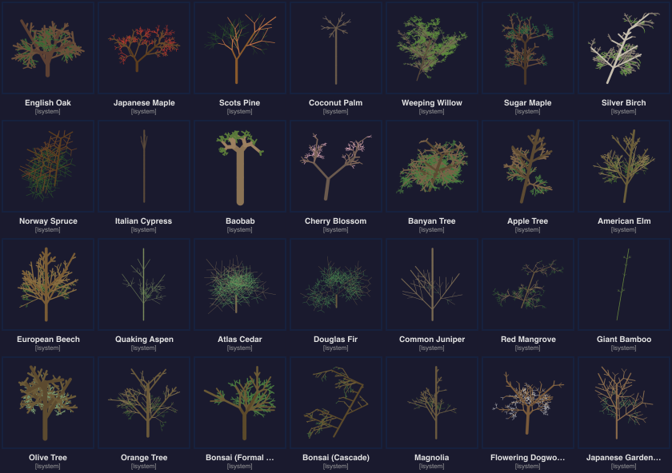

| ID | Name | Scientific Name | Engine | Complexity |
|---|---|---|---|---|
| `english-oak` | English Oak | *Quercus robur* | lsystem | complex |
| `sugar-maple` | Sugar Maple | *Acer saccharum* | lsystem | complex |
| `japanese-maple` | Japanese Maple | *Acer palmatum* | lsystem | complex |
| `silver-birch` | Silver Birch | *Betula pendula* | lsystem | moderate |
| `weeping-willow` | Weeping Willow | *Salix babylonica* | lsystem | showcase |
| `scots-pine` | Scots Pine | *Pinus sylvestris* | lsystem | complex |
| `norway-spruce` | Norway Spruce | *Picea abies* | lsystem | moderate |
| `italian-cypress` | Italian Cypress | *Cupressus sempervirens* | lsystem | basic |
| `coconut-palm` | Coconut Palm | *Cocos nucifera* | lsystem | moderate |
| `baobab` | Baobab | *Adansonia digitata* | lsystem | complex |
| `cherry-blossom` | Cherry Blossom | *Prunus serrulata* | lsystem | complex |
| `banyan-tree` | Banyan Tree | *Ficus benghalensis* | lsystem | showcase |
| `apple-tree` | Apple Tree | *Malus domestica* | lsystem | moderate |
| `american-elm` | American Elm | *Ulmus americana* | lsystem | complex |
| `european-beech` | European Beech | *Fagus sylvatica* | lsystem | complex |
| `quaking-aspen` | Quaking Aspen | *Populus tremuloides* | lsystem | moderate |
| `atlas-cedar` | Atlas Cedar | *Cedrus atlantica* | lsystem | complex |
| `douglas-fir` | Douglas Fir | *Pseudotsuga menziesii* | lsystem | moderate |
| `common-juniper` | Common Juniper | *Juniperus communis* | lsystem | moderate |
| `red-mangrove` | Red Mangrove | *Rhizophora mangle* | lsystem | complex |
| `giant-bamboo` | Giant Bamboo | *Dendrocalamus giganteus* | lsystem | moderate |
| `olive-tree` | Olive Tree | *Olea europaea* | lsystem | complex |
| `orange-tree` | Orange Tree | *Citrus sinensis* | lsystem | moderate |
| `bonsai-formal-upright` | Bonsai (Formal Upright) | — | lsystem | complex |
| `bonsai-cascade` | Bonsai (Cascade) | — | lsystem | complex |
| `magnolia` | Magnolia | *Magnolia grandiflora* | lsystem | complex |
| `flowering-dogwood` | Flowering Dogwood | *Cornus florida* | lsystem | moderate |
| `japanese-garden-pine` | Japanese Garden Pine | *Pinus thunbergii* | lsystem | showcase |

### Ferns (10)

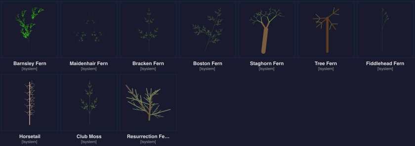

| ID | Name | Scientific Name | Engine | Complexity |
|---|---|---|---|---|
| `barnsley-fern` | Barnsley Fern | *Dryopteris filix-mas* | lsystem | moderate |
| `maidenhair-fern` | Maidenhair Fern | *Adiantum capillus-veneris* | lsystem | complex |
| `bracken-fern` | Bracken | *Pteridium aquilinum* | lsystem | moderate |
| `boston-fern` | Boston Fern | *Nephrolepis exaltata* | lsystem | moderate |
| `staghorn-fern` | Staghorn Fern | *Platycerium bifurcatum* | lsystem | complex |
| `tree-fern` | Tree Fern | *Cyathea cooperi* | lsystem | complex |
| `fiddlehead` | Fiddlehead | *Matteuccia struthiopteris* | geometric | basic |
| `horsetail` | Horsetail | *Equisetum hyemale* | lsystem | basic |
| `club-moss` | Club Moss | *Lycopodium clavatum* | lsystem | moderate |
| `resurrection-fern` | Resurrection Fern | *Pleopeltis polypodioides* | lsystem | moderate |

### Flowers (22)

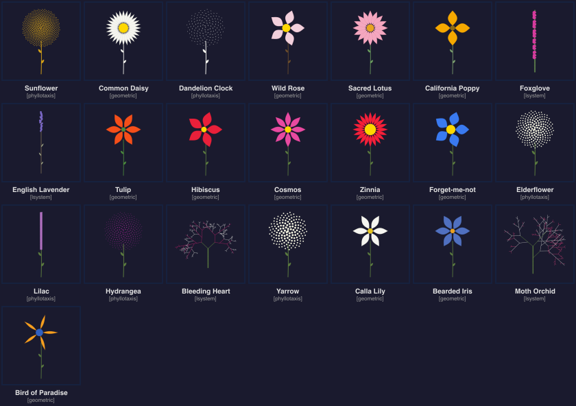

| ID | Name | Scientific Name | Engine | Complexity |
|---|---|---|---|---|
| `sunflower` | Sunflower | *Helianthus annuus* | phyllotaxis | showcase |
| `common-daisy` | Common Daisy | *Bellis perennis* | geometric | basic |
| `dandelion-clock` | Dandelion Clock | *Taraxacum officinale* | phyllotaxis | moderate |
| `wild-rose` | Wild Rose | *Rosa canina* | geometric | moderate |
| `lotus` | Lotus | *Nelumbo nucifera* | geometric | complex |
| `california-poppy` | California Poppy | *Eschscholzia californica* | geometric | basic |
| `foxglove` | Foxglove | *Digitalis purpurea* | lsystem | complex |
| `english-lavender` | English Lavender | *Lavandula angustifolia* | lsystem | moderate |
| `tulip` | Tulip | *Tulipa gesneriana* | geometric | basic |
| `hibiscus` | Hibiscus | *Hibiscus rosa-sinensis* | geometric | moderate |
| `cosmos` | Cosmos | *Cosmos bipinnatus* | geometric | basic |
| `zinnia` | Zinnia | *Zinnia elegans* | geometric | moderate |
| `forget-me-not` | Forget-me-not | *Myosotis sylvatica* | geometric | basic |
| `calla-lily` | Calla Lily | *Zantedeschia aethiopica* | geometric | moderate |
| `bearded-iris` | Bearded Iris | *Iris germanica* | geometric | complex |
| `bird-of-paradise` | Bird of Paradise | *Strelitzia reginae* | geometric | complex |
| `elderflower` | Elderflower | *Sambucus nigra* | phyllotaxis | moderate |
| `lilac` | Lilac | *Syringa vulgaris* | phyllotaxis | complex |
| `hydrangea` | Hydrangea | *Hydrangea macrophylla* | phyllotaxis | showcase |
| `yarrow` | Yarrow | *Achillea millefolium* | phyllotaxis | moderate |
| `bleeding-heart` | Bleeding Heart | *Lamprocapnos spectabilis* | lsystem | complex |
| `moth-orchid` | Moth Orchid | *Phalaenopsis amabilis* | lsystem | showcase |

### Grasses (12)

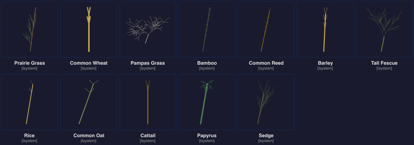

| ID | Name | Scientific Name | Engine | Complexity |
|---|---|---|---|---|
| `prairie-grass` | Prairie Grass | *Schizachyrium scoparium* | lsystem | moderate |
| `common-wheat` | Common Wheat | *Triticum aestivum* | lsystem | basic |
| `pampas-grass` | Pampas Grass | *Cortaderia selloana* | lsystem | complex |
| `bamboo-culm` | Bamboo Culm | *Phyllostachys edulis* | lsystem | moderate |
| `common-reed` | Common Reed | *Phragmites australis* | lsystem | moderate |
| `barley` | Barley | *Hordeum vulgare* | lsystem | basic |
| `tall-fescue` | Tall Fescue | *Festuca arundinacea* | lsystem | basic |
| `rice` | Rice | *Oryza sativa* | lsystem | basic |
| `common-oat` | Common Oat | *Avena sativa* | lsystem | basic |
| `cattail` | Cattail | *Typha latifolia* | lsystem | moderate |
| `papyrus` | Papyrus | *Cyperus papyrus* | lsystem | complex |
| `sedge` | Sedge | *Carex pendula* | lsystem | basic |

### Vines (10)

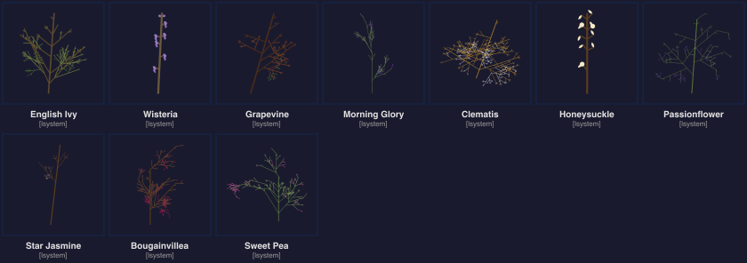

| ID | Name | Scientific Name | Engine | Complexity |
|---|---|---|---|---|
| `english-ivy` | English Ivy | *Hedera helix* | lsystem | complex |
| `wisteria` | Wisteria | *Wisteria sinensis* | lsystem | showcase |
| `grapevine` | Grapevine | *Vitis vinifera* | lsystem | complex |
| `morning-glory` | Morning Glory | *Ipomoea nil* | lsystem | moderate |
| `clematis` | Clematis | *Clematis vitalba* | lsystem | complex |
| `honeysuckle` | Honeysuckle | *Lonicera periclymenum* | lsystem | moderate |
| `passionflower` | Passionflower | *Passiflora caerulea* | lsystem | showcase |
| `star-jasmine` | Star Jasmine | *Trachelospermum jasminoides* | lsystem | moderate |
| `bougainvillea` | Bougainvillea | *Bougainvillea spectabilis* | lsystem | complex |
| `sweet-pea` | Sweet Pea | *Lathyrus odoratus* | lsystem | moderate |

### Succulents (10)

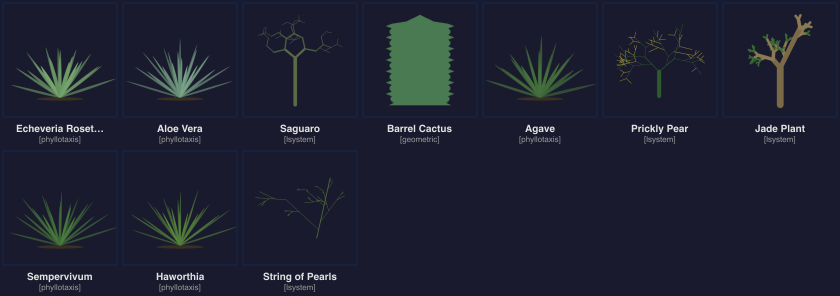

| ID | Name | Scientific Name | Engine | Complexity |
|---|---|---|---|---|
| `echeveria` | Echeveria | *Echeveria elegans* | phyllotaxis | moderate |
| `aloe-vera` | Aloe Vera | *Aloe vera* | phyllotaxis | moderate |
| `saguaro` | Saguaro Cactus | *Carnegiea gigantea* | lsystem | complex |
| `barrel-cactus` | Barrel Cactus | *Ferocactus wislizeni* | geometric | moderate |
| `agave` | Agave | *Agave americana* | phyllotaxis | complex |
| `sempervivum` | Sempervivum | *Sempervivum tectorum* | phyllotaxis | moderate |
| `haworthia` | Haworthia | *Haworthia fasciata* | phyllotaxis | moderate |
| `prickly-pear` | Prickly Pear | *Opuntia ficus-indica* | lsystem | moderate |
| `jade-plant` | Jade Plant | *Crassula ovata* | lsystem | moderate |
| `string-of-pearls` | String of Pearls | *Senecio rowleyanus* | lsystem | basic |

### Herbs & Shrubs (8)

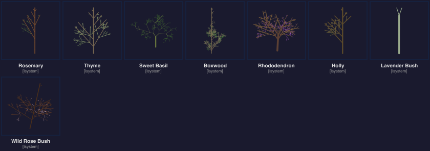

| ID | Name | Scientific Name | Engine | Complexity |
|---|---|---|---|---|
| `rosemary` | Rosemary | *Salvia rosmarinus* | lsystem | moderate |
| `thyme` | Thyme | *Thymus vulgaris* | lsystem | basic |
| `sweet-basil` | Sweet Basil | *Ocimum basilicum* | lsystem | basic |
| `boxwood` | Boxwood | *Buxus sempervirens* | lsystem | moderate |
| `rhododendron` | Rhododendron | *Rhododendron ponticum* | lsystem | complex |
| `holly` | Holly | *Ilex aquifolium* | lsystem | moderate |
| `lavender-bush` | Lavender Bush | *Lavandula stoechas* | lsystem | moderate |
| `wild-rose-bush` | Wild Rose Bush | *Rosa rugosa* | lsystem | moderate |

### Aquatic (5)

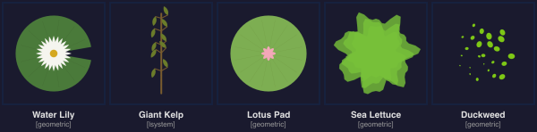

| ID | Name | Scientific Name | Engine | Complexity |
|---|---|---|---|---|
| `water-lily` | Water Lily | *Nymphaea alba* | geometric | moderate |
| `giant-kelp` | Giant Kelp | *Macrocystis pyrifera* | lsystem | complex |
| `lotus-pad` | Lotus Pad | *Nelumbo nucifera* | geometric | basic |
| `sea-lettuce` | Sea Lettuce | *Ulva lactuca* | geometric | basic |
| `duckweed` | Duckweed | *Lemna minor* | geometric | basic |

### Roots (5)

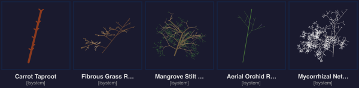

| ID | Name | Scientific Name | Engine | Complexity |
|---|---|---|---|---|
| `carrot-taproot` | Carrot Taproot | *Daucus carota* | lsystem | moderate |
| `fibrous-grass-root` | Fibrous Grass Root | *Poaceae* | lsystem | moderate |
| `mangrove-stilt-roots` | Mangrove Stilt Roots | *Rhizophora* | lsystem | complex |
| `aerial-orchid-root` | Aerial Orchid Root | *Vanda* | lsystem | moderate |
| `mycorrhizal-network` | Mycorrhizal Network | *Glomus* | lsystem | showcase |

## MCP Tools (19)

Exposed to AI agents through the MCP server when this plugin is registered:

| Tool | Description |
|---|---|
| `add_plant` | Add a plant layer from any of the 110 presets |
| `list_plant_presets` | List presets filtered by category, tags, complexity, or engine |
| `search_plants` | Full-text search across names, scientific names, descriptions, tags |
| `set_plant_grammar` | Edit L-system axiom, iterations, angle, length/width decay |
| `set_plant_tropism` | Configure gravity and susceptibility forces |
| `set_plant_season` | Switch color palette to spring/summer/autumn/winter |
| `grow_plant` | Step iterations up or down (seedling → sapling → mature → ancient) |
| `create_garden` | Compose multiple plants with positions, seeds, and scale |
| `randomize_plant` | Add a random plant, optionally constrained by category or engine |
| `analyze_phyllotaxis` | Compute parastichy numbers and Fibonacci analysis |
| `explain_grammar` | Human-readable L-system explanation with optional derivation trace |
| `create_inflorescence` | Flower cluster arrangements (bouquet, wreath, meadow, row, spiral) |
| `set_plant_style` | Set drawing style and detail level for a plant layer |
| `suggest_plant_style` | AI-suggested style based on species and context |
| `set_plant_growth` | Configure growth animation (tDOL time, curve, speed) |
| `advance_plant_growth` | Step growth forward/backward in time |
| `set_plant_wind` | Configure wind direction, strength, turbulence, gusts |
| `create_ecosystem` | Multi-species ecosystem with depth lanes, arrangement, atmosphere |
| `export_plant_paths` | Export structural geometry as path data (painting bridge, ADR 072) |

## Preset Discovery

```typescript
import { ALL_PRESETS, filterPresets, searchPresets, getCategories, getAllTags } from "@genart-dev/plugin-plants";

// All 110 presets
console.log(ALL_PRESETS.length); // 110

// Filter by category
const trees = filterPresets({ category: "trees" }); // 28 presets

// Filter by engine
const phyllotaxis = filterPresets({ engine: "phyllotaxis" }); // ~15 presets

// Filter by complexity
const showcases = filterPresets({ complexity: "showcase" }); // ~10 presets

// Filter by tags
const tropical = filterPresets({ tags: ["tropical"] });

// Full-text search
const results = searchPresets("fibonacci"); // sunflower, echeveria, ...

// Available categories and tags
getCategories(); // ["trees", "ferns", "flowers", ...]
getAllTags();     // ["adhesive", "annual", "bamboo", ...]
```

## Tropism

Plants respond to environmental forces via the tropism system:

```typescript
import { applyTropism, createTropism } from "@genart-dev/plugin-plants";

// Positive gravity = upward growth (phototropism)
// Negative gravity = drooping (gravitropism)
const tropism = createTropism({ gravity: -0.4, susceptibility: 0.5 });
```

| Species | Gravity | Effect |
|---|---|---|
| Weeping Willow | -0.72 | Strong drooping branches |
| Coconut Palm | -0.55 | Fronds curve downward |
| Morning Glory | +0.45 | Climbs upward toward light |
| Sweet Pea | +0.55 | Strong upward climbing |
| English Oak | -0.25 | Slight droop in outer branches |

## v2 Features

### 3D Turtle Projection

The 3D turtle engine adds depth via camera projection, enabling perspective views of plants. Branches grow in 3D space and are projected to the canvas with depth-based opacity and scale.

```typescript
import { turtle3DInterpret } from "@genart-dev/plugin-plants";

const output = turtle3DInterpret(modules, {
  ...turtleConfig,
  camera: { distance: 500, elevation: 15, azimuth: 30 },
});
```

### Growth Animation

Continuous growth via time-dependent L-systems (tDOL). The `filterByGrowthTime` function clips geometry to a growth parameter, enabling smooth seed-to-bloom animation.

```typescript
import { iterateTaggedLSystem, filterByGrowthTime, applyGrowthCurve } from "@genart-dev/plugin-plants";

const tagged = iterateTaggedLSystem(definition, 6);
const t = applyGrowthCurve(0.5, "ease-in-out"); // half-grown
const visible = filterByGrowthTime(tagged, t);
```

### Wind Dynamics

Procedural wind simulation bends branches based on direction, strength, and Perlin noise turbulence. Supports steady breeze and intermittent gusts.

```typescript
import { createWindNoise, computeWindStrength, DEFAULT_WIND_CONFIG } from "@genart-dev/plugin-plants";

const noise = createWindNoise(42);
const strength = computeWindStrength({ ...DEFAULT_WIND_CONFIG, direction: 45, strength: 0.6 }, time, noise);
```

### Ecosystem Composition

The `plants:ecosystem` layer type and `create_ecosystem` MCP tool compose multiple species with automatic depth placement, atmospheric color grading, and arrangement patterns (scattered, clustered, row, arc).

### Fruit, Bark & Veins

Detailed botanical features rendered through the style system:

- **Fruit**: Apple, cherry, orange, berry, pine cone — placed at branch tips
- **Bark**: Smooth, rough, peeling, plated, furrowed textures on trunks
- **Veins**: Pinnate, palmate, parallel patterns on leaves

### Painting Bridge (ADR 072)

Export structural geometry as path data for use with `@genart-dev/plugin-painting` layers:

```typescript
import { structuralOutputToPathChannels } from "@genart-dev/plugin-plants";

const channels = structuralOutputToPathChannels(output, transform);
// channels.branches, channels.leaves — path data for painting layers
```

### Segment Cache

Expensive L-system generation is cached by preset + seed + iterations key, avoiding redundant computation when only style or colors change.

## Related Packages

| Package | Purpose |
|---|---|
| [`@genart-dev/core`](https://github.com/genart-dev/core) | Plugin host, layer system (dependency) |
| [`@genart-dev/mcp-server`](https://github.com/genart-dev/mcp-server) | MCP server that surfaces plugin tools to AI agents |

## Support

Questions, bugs, or feedback — [support@genart.dev](mailto:support@genart.dev) or [open an issue](https://github.com/genart-dev/plugin-plants/issues).

## License

MIT
